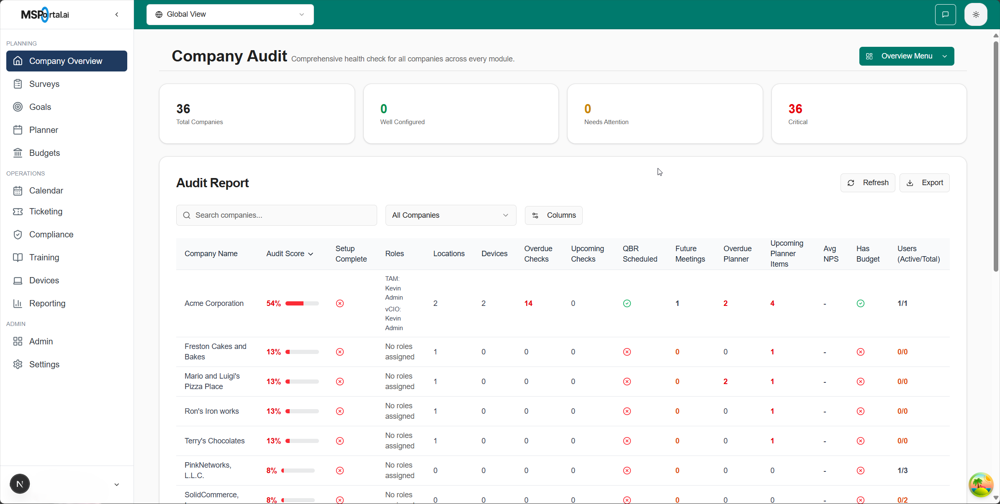

## Overview

The Company Audit page provides a tenant‑scoped rollup of key readiness indicators for each company. It consolidates data from roles, meetings (QBR), users, locations, devices, planner, compliance, surveys, and budgets into a single view.

## Data source

All metrics are provided by the consolidated database view `public.v_company_audit`.

- Tenant scoping: All queries are scoped by `tenant_id`.
- Company scoping: All rows are per `companies.id`.

## Key columns

- Company Name: The company record from `companies`.
- Roles: Roles assigned per company, derived from `company_user_roles` joined with `company_roles` and `users`.
- QBR Scheduled: True if business review is scheduled on the company or a QBR meeting exists.
- Next QBR: Next scheduled/confirmed QBR meeting date.
- Users (Active/Total): Shown as `active/total`, where
  - total = distinct union of users with `users.company_id` and users linked via `company_user_roles`
  - active = those users with `last_login` in the last 30 days
- Locations / Devices: Counts from `locations` and `devices`.
- Upcoming Planner Items: Number of planner items with `due_date > NOW()`.
- Upcoming Checks: Count of `compliance_assigned` with `due_date` in the next 30 days.
- Surveys: Total invites and completed (from `general_survey_invites`).
- Budget: Presence of budget line items and totals.

## Setup Complete

A company is considered “Setup Complete” when all of the following are true:

- At least one role is assigned (`assigned_roles > 0`).
- A QBR is scheduled (either `business_review_schedule` present or an upcoming/last QBR exists).
- At least one user exists (`users_count > 0`).
- At least one location and at least one device exist.
- At least one upcoming planner item exists (`upcoming_planner_items > 0`).
- At least one upcoming compliance check exists (`compliance_upcoming > 0`).

## Notes

- Users are counted as the union of users directly linked to a company (`users.company_id`) and users linked via the junction table (`company_user_roles`). This avoids under‑counting while you transition data.
- Active users are those with `last_login` within the last 30 days.
- Upcoming checks use `compliance_assigned` with `due_date` in the next 30 days.

## Troubleshooting

- If “Setup Complete” is false, check the visible columns:
  - Roles, Users (Active/Total), Locations, Devices, Upcoming Planner Items, Upcoming Checks, QBR Scheduled.
- If counts seem low, verify tenant scoping and that records carry the correct `tenant_id` and `company_id`.
